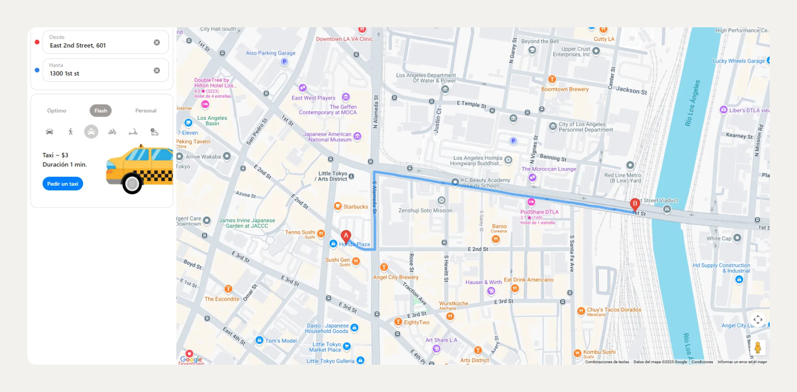

# 🧪 Proyecto 1 – Pruebas de regresión en Urban Routes
Ejercicio de QA manual donde ejecuté pruebas de regresión sobre una app de rutas de transporte. Incluye reporte de errores y hoja de resultados.

## 📌 Contexto
Este proyecto fue realizado durante mi formación como QA Engineer en el bootcamp de [TripleTen]. Urban Routes es una aplicación web de transporte que permite al usuario calcular rutas, duración del viaje y costos según el medio de transporte elegido.

## 🎯 Objetivo
Ejecutar pruebas de regresión para asegurar que las nuevas versiones de Urban Routes no introduzcan errores en funcionalidades existentes.

## 🛠️ Herramientas utilizadas
- Navegador: Google Chrome (última versión)
- Google Sheets (para documentación de pruebas y errores)
- Capturas de pantalla proporcionadas por la escuela
- Servidor local de la aplicación

## 👨‍🔬 Actividades realizadas
- Configuración y ejecución del entorno de pruebas
- Ejecución de los casos de prueba disponibles [ver plantilla de casos](https://docs.google.com/spreadsheets/d/1WdJ2lAz2TwU_-w-IanDAlUJC5ydoAvc4/edit#gid=1168870724)
- Verificación de resultados esperados vs actuales
- Registro de errores encontrados, con asignación de severidad: Bloqueador, Crítico, Grave, Menor o Trivial
- Elaboración de reportes de errores y pruebas de humo

## ✅ Habilidades técnicas aplicadas
- Pruebas manuales de regresión y de humo
- Documentación de errores con detalle técnico
- Comunicación clara con el equipo QA 
- Análisis funcional de interfaces web

## 🧾 Resultados
- Más de 30 casos de prueba ejecutados
- Registro de múltiples errores clasificados por severidad
- Generación de evidencias de ejecución y documentación clara de resultados

## 🧠 Lecciones aprendidas
- Validar funcionalidades nuevas y existentes sin generar regresiones
- Importancia de una buena experiencia de usuario final
- Estandarización en la documentación de pruebas

## 🔗 Recursos
- [Plantilla de casos de prueba](https://docs.google.com/spreadsheets/d/1WdJ2lAz2TwU_-w-IanDAlUJC5ydoAvc4/edit#gid=1168870724)
- Pantalla principal 

---

